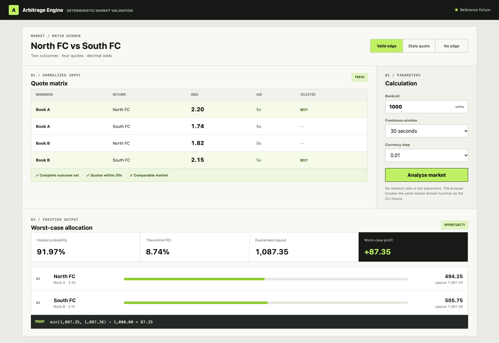
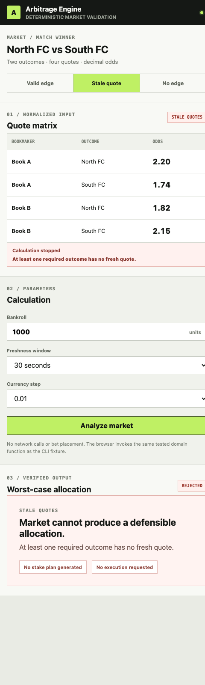
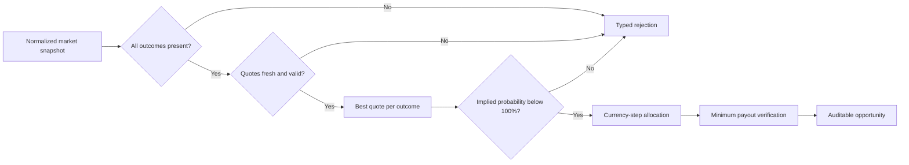

# Arbitrage Betting Engine

**A deterministic TypeScript lab for validating and sizing cross-book sports-market arbitrage.**

The engine converts normalized decimal-odds snapshots into one of two explicit outcomes: a fully auditable stake plan with its guaranteed worst-case payout, or a typed rejection explaining why the market is unsafe to calculate.

> Status: functional reference implementation. The repository contains an interactive browser demo, real calculation code, six deterministic tests, a runnable CLI fixture, CI, and security scanning. It does not scrape bookmakers, place bets, hold credentials, or claim guaranteed real-world execution.

## Product interface

<table>
  <tr>
    <td width="72%" valign="top">
      
      <strong>Verified opportunity.</strong> The interface exposes the quote matrix, selected prices, calculation parameters, rounded allocation, and minimum-payout proof.
    </td>
    <td width="28%" valign="top">
      
      <strong>Fail-closed state.</strong> A stale required outcome produces no stake plan and requests no execution.
    </td>
  </tr>
</table>

_Both screenshots come from the included working browser demo using reference fixtures, not live bookmaker data or a design mockup._


_Explanatory diagram generated from the included fixture. It is not a live-bookmaker screenshot._

## The problem

Finding two attractive prices is not enough. A credible arbitrage system must prove that the quotes describe the same settled market, cover every possible outcome, remain fresh at execution time, and still produce positive worst-case profit after stake rounding.

| Failure mode               | Naive implementation                         | Engine response                                      |
| -------------------------- | -------------------------------------------- | ---------------------------------------------------- |
| Missing outcome            | Calculates from the visible selections only | Rejects an incomplete market                         |
| Stale price                | Mixes quotes captured at different moments   | Requires a fresh quote for every outcome             |
| Wrong market identity      | Compares similarly named but different bets  | Accepts an explicit normalized outcome set           |
| Invalid odds               | Produces division errors or impossible stakes | Validates decimal odds and timestamps                |
| Stake rounding             | Reports theoretical profit that cannot be bet | Allocates currency units and recomputes minimum payout |
| No real edge               | Treats the best single price as arbitrage     | Requires total implied probability below 100%        |

## Example

For a two-outcome market, the engine selects `2.20` for North FC and `2.15` for South FC from different books:

```text
implied probability = 1 / 2.20 + 1 / 2.15 = 0.9197
theoretical ROI     = 1 / 0.9197 - 1          = 8.73%
```

With a `1,000.00` bankroll, the allocator works in currency steps, distributes the rounding remainder to the lowest projected payout, and verifies the result again:

| Outcome  | Book   | Odds | Stake  | Payout   |
| -------- | ------ | ---: | -----: | -------: |
| North FC | Book A | 2.20 | 494.25 | 1,087.35 |
| South FC | Book B | 2.15 | 505.75 | 1,087.36 |

The guaranteed result is the **minimum** of the possible payouts, not the average or best case: `1,087.35 - 1,000.00 = 87.35` units.

## Execution pipeline



## Technical design

The repository is split into three boundaries so the user interface cannot quietly redefine the financial result:

```text
Reference browser UI
  ├─ builds a normalized MarketSnapshot
  ├─ selects bankroll, freshness, and currency step
  └─ renders an opportunity or typed rejection
                     │
                     ▼
Pure TypeScript domain engine
  ├─ validates quote shape and outcome coverage
  ├─ selects the highest fresh quote per outcome
  ├─ calculates implied probability
  ├─ allocates integer currency units
  └─ verifies minimum rounded payout
                     │
                     ▼
Future provider / execution adapters
  ├─ normalize external identifiers and settlement rules
  ├─ expose limits, commission, and quote timestamps
  └─ require a separate approval and execution contract
```

The current repository implements the first two layers. The third is deliberately documented as an integration boundary rather than presented as working bookmaker connectivity.

### Data contracts

`MarketSnapshot` carries an explicit outcome set. Quotes are not allowed to define the market implicitly, because a missing draw or an omitted competitor would create a false edge.

```ts
interface MarketSnapshot {
  marketId: string;
  event: string;
  startsAt: string;
  outcomes: string[];
  quotes: MarketQuote[];
}

type AnalysisResult = ArbitrageOpportunity | RejectedMarket;
```

The result is a discriminated union. Consumers must handle `status: "opportunity"` and `status: "rejected"` separately before allocations become accessible.

### Quote selection

The engine makes one pass over provider quotes and keeps the highest fresh decimal price for each declared outcome:

```ts
for (const quote of snapshot.quotes) {
  if (!expected.has(quote.outcome) || now.getTime() - Date.parse(quote.capturedAt) > maxQuoteAgeMs) continue;

  const current = best.get(quote.outcome);
  if (!current || quote.decimalOdds > current.decimalOdds) {
    best.set(quote.outcome, quote);
  }
}
```

Quote selection is `O(q)` for `q` quotes. Allocation is bounded by the number of outcomes; after flooring ideal stakes, fewer than one currency unit per outcome normally remains to distribute. The complete calculation is effectively `O(q + o²)` with `o` market outcomes and constant memory per quote/outcome key.

### Allocation and proof

Ideal equal-payout stakes are calculated from inverse decimal odds. They are then floored to integer currency units. Remaining units are assigned one at a time to the currently lowest projected payout, after which profit is recomputed from the minimum rounded payout:

```ts
const guaranteedPayout = Math.min(...allocations.map((item) => item.payout));
const guaranteedProfit = roundCurrency(guaranteedPayout - totalStake);
```

This final proof is the number displayed by the UI. Theoretical ROI is retained for diagnosis but never substituted for executable rounded profit.

### Rejection taxonomy

| Reason                  | Meaning                                                        | Operational response                    |
| ----------------------- | -------------------------------------------------------------- | --------------------------------------- |
| `invalid_quote`         | Odds, timestamp, bankroll, step, or outcome set is malformed   | Fix normalization; do not calculate    |
| `incomplete_market`     | At least one declared outcome has no quote                     | Wait for complete market coverage       |
| `stale_quotes`          | A required outcome has no quote inside the freshness window    | Refresh every side before recalculation |
| `no_arbitrage`          | Best fresh implied probabilities total 100% or more            | Discard the candidate                   |
| `rounding_removed_edge` | Currency-step allocation removes the theoretical profit        | Increase precision or discard           |

### Product and UI rationale

- **Quote matrix before profit:** users can inspect source prices before seeing an attractive headline number.
- **Parameters remain visible:** bankroll, freshness, and currency step explain why two runs may differ.
- **Best prices are marked in context:** selection is visible without hiding rejected alternatives.
- **Worst-case result gets visual priority:** the interface emphasizes minimum payout, not the most favorable outcome.
- **Rejections use the same workspace:** failure is a normal product state with an actionable reason, not an empty screen.
- **No execution button:** this reference implementation does not imply that a mathematical plan was accepted by external books.

## Core API

```ts
const result = analyzeMarket(snapshot, {
  bankroll: 1_000,
  now: new Date("2026-10-06T12:00:00.000Z"),
  maxQuoteAgeMs: 30_000,
  currencyStep: 0.01,
});

if (result.status === "opportunity") {
  console.log(result.guaranteedProfit, result.allocations);
} else {
  console.log(result.reason, result.details);
}
```

The discriminated result makes failure states part of the contract. A caller cannot accidentally treat stale or incomplete data as an empty but valid opportunity.

## Why the implementation is deterministic

- **Declared outcome order:** stake plans remain stable regardless of provider response order.
- **Best fresh quote only:** stale prices never participate in price selection.
- **Currency-unit allocation:** the engine sizes integer stake units rather than hiding floating-point residue.
- **Worst-case accounting:** profit comes from the smallest rounded payout across all outcomes.
- **Pure domain layer:** the calculation has no network calls, credentials, storage, or bookmaker-specific parsing.
- **Typed rejection reasons:** monitoring can distinguish bad data, lost edge, and rounding failures.

## What the tests prove

1. The best cross-book combination is selected in declared outcome order.
2. Rounded stakes consume the configured bankroll and nearly equalize payouts.
3. Markets at or above 100% implied probability are rejected.
4. A stale required outcome fails closed.
5. Incomplete outcome coverage is rejected.
6. Invalid decimal odds never reach the calculation.

## Domain invariants

- Total allocated stake equals the configured bankroll at the selected currency step.
- Every allocation corresponds to exactly one declared outcome.
- Only fresh quotes can become selected prices.
- Opportunity output exists only when implied probability is below `1`.
- Guaranteed payout equals the smallest rounded outcome payout.
- Guaranteed profit must remain positive after allocation and rounding.
- A rejection contains no executable allocation.

## Run locally

```bash
npm install
npm run dev
npm run check
npm test
npm run build
npm run demo
```

Open `http://127.0.0.1:5173`. Use the three scenario controls to compare a valid edge, stale quote coverage, and a market with no edge.

## Repository map

| Path                  | Responsibility                                                   |
| --------------------- | ---------------------------------------------------------------- |
| `src/engine.ts`       | Quote selection, validation, allocation, and final proof         |
| `src/types.ts`        | Market, allocation, opportunity, and rejection contracts        |
| `src/app.ts`          | Interactive fixture scenarios and typed result presentation      |
| `src/styles.css`      | Responsive operations-oriented interface                         |
| `test/engine.test.ts` | Deterministic edge cases and failure-mode coverage                |
| `examples/run.ts`     | Reproducible two-book CLI calculation                             |
| `assets/`             | Real product screenshots and explanatory system visual           |
| `.github/workflows/`  | TypeScript, tests, production build, demo, and Semgrep checks     |

## Production integration boundary

A production system should keep provider ingestion and execution outside the pure engine. One possible contract is:

```ts
interface QuoteProvider {
  readMarket(externalMarketId: string): Promise<MarketSnapshot>;
}

interface ExecutionAdapter {
  preview(plan: ArbitrageOpportunity): Promise<ExecutionPreview>;
  execute(approvedPreviewId: string): Promise<ExecutionReceipt>;
}
```

`preview` would revalidate odds, limits, commission, account currency, and settlement rules. `execute` would require an independently approved preview identifier and record partial acceptance explicitly. Neither interface is implemented here because doing so without real compliance and operational controls would weaken the honesty of the showcase.

## Real-world boundaries

The mathematical result is only as reliable as execution. Real systems must additionally handle quote movement, limits, rejected stakes, partial acceptance, commissions, currency conversion, settlement-rule differences, account restrictions, voided markets, and jurisdiction-specific regulation.

This repository intentionally stops before scraping or bet placement. Those adapters involve legal, operational, and credential risks and should not be disguised as part of a pure calculation engine.

## License

[MIT](LICENSE)

---

Built by [0xENTYPER](https://github.com/0xENTYPER).
