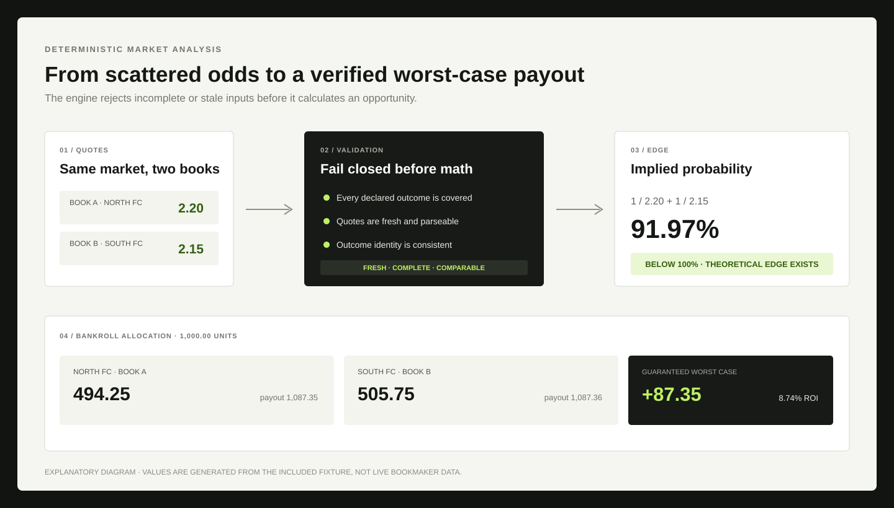
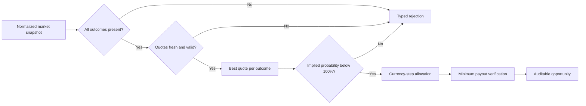

# Arbitrage Betting Engine

**A deterministic TypeScript lab for validating and sizing cross-book sports-market arbitrage.**

The engine converts normalized decimal-odds snapshots into one of two explicit outcomes: a fully auditable stake plan with its guaranteed worst-case payout, or a typed rejection explaining why the market is unsafe to calculate.

> Status: functional reference implementation. The repository contains real calculation code, six deterministic tests, a runnable fixture, CI, and security scanning. It does not scrape bookmakers, place bets, hold credentials, or claim guaranteed real-world execution.



_Explanatory diagram generated from the included fixture. It is not a live-bookmaker screenshot._

## The problem

Finding two attractive prices is not enough. A credible arbitrage system must prove that the quotes describe the same settled market, cover every possible outcome, remain fresh at execution time, and still produce positive worst-case profit after stake rounding.

| Failure mode               | Naive implementation                         | Engine response                                      |
| -------------------------- | -------------------------------------------- | ---------------------------------------------------- |
| Missing outcome            | Calculates from the visible selections only | Rejects an incomplete market                         |
| Stale price                | Mixes quotes captured at different moments   | Requires a fresh quote for every outcome             |
| Wrong market identity      | Compares similarly named but different bets  | Accepts an explicit normalized outcome set           |
| Invalid odds               | Produces division errors or impossible stakes | Validates decimal odds and timestamps                |
| Stake rounding             | Reports theoretical profit that cannot be bet | Allocates currency units and recomputes minimum payout |
| No real edge               | Treats the best single price as arbitrage     | Requires total implied probability below 100%        |

## Example

For a two-outcome market, the engine selects `2.20` for North FC and `2.15` for South FC from different books:

```text
implied probability = 1 / 2.20 + 1 / 2.15 = 0.9197
theoretical ROI     = 1 / 0.9197 - 1          = 8.73%
```

With a `1,000.00` bankroll, the allocator works in currency steps, distributes the rounding remainder to the lowest projected payout, and verifies the result again:

| Outcome  | Book   | Odds | Stake  | Payout   |
| -------- | ------ | ---: | -----: | -------: |
| North FC | Book A | 2.20 | 494.25 | 1,087.35 |
| South FC | Book B | 2.15 | 505.75 | 1,087.36 |

The guaranteed result is the **minimum** of the possible payouts, not the average or best case: `1,087.35 - 1,000.00 = 87.35` units.

## Execution pipeline



## Core API

```ts
const result = analyzeMarket(snapshot, {
  bankroll: 1_000,
  now: new Date("2026-10-06T12:00:00.000Z"),
  maxQuoteAgeMs: 30_000,
  currencyStep: 0.01,
});

if (result.status === "opportunity") {
  console.log(result.guaranteedProfit, result.allocations);
} else {
  console.log(result.reason, result.details);
}
```

The discriminated result makes failure states part of the contract. A caller cannot accidentally treat stale or incomplete data as an empty but valid opportunity.

## Why the implementation is deterministic

- **Declared outcome order:** stake plans remain stable regardless of provider response order.
- **Best fresh quote only:** stale prices never participate in price selection.
- **Currency-unit allocation:** the engine sizes integer stake units rather than hiding floating-point residue.
- **Worst-case accounting:** profit comes from the smallest rounded payout across all outcomes.
- **Pure domain layer:** the calculation has no network calls, credentials, storage, or bookmaker-specific parsing.
- **Typed rejection reasons:** monitoring can distinguish bad data, lost edge, and rounding failures.

## What the tests prove

1. The best cross-book combination is selected in declared outcome order.
2. Rounded stakes consume the configured bankroll and nearly equalize payouts.
3. Markets at or above 100% implied probability are rejected.
4. A stale required outcome fails closed.
5. Incomplete outcome coverage is rejected.
6. Invalid decimal odds never reach the calculation.

## Run locally

```bash
npm install
npm run check
npm test
npm run demo
```

## Repository map

| Path                   | Responsibility                                          |
| ---------------------- | ------------------------------------------------------- |
| `src/engine.ts`        | Quote selection, validation, allocation, and final proof |
| `src/types.ts`         | Market, allocation, opportunity, and rejection contracts |
| `test/engine.test.ts`  | Deterministic edge cases and failure-mode coverage       |
| `examples/run.ts`      | Reproducible two-book calculation                        |
| `assets/`              | Explanatory product visual                               |
| `.github/workflows/`   | TypeScript, tests, demo, and Semgrep checks              |

## Real-world boundaries

The mathematical result is only as reliable as execution. Real systems must additionally handle quote movement, limits, rejected stakes, partial acceptance, commissions, currency conversion, settlement-rule differences, account restrictions, voided markets, and jurisdiction-specific regulation.

This repository intentionally stops before scraping or bet placement. Those adapters involve legal, operational, and credential risks and should not be disguised as part of a pure calculation engine.

## License

[MIT](LICENSE)

---

Built by [0xENTYPER](https://github.com/0xENTYPER).
